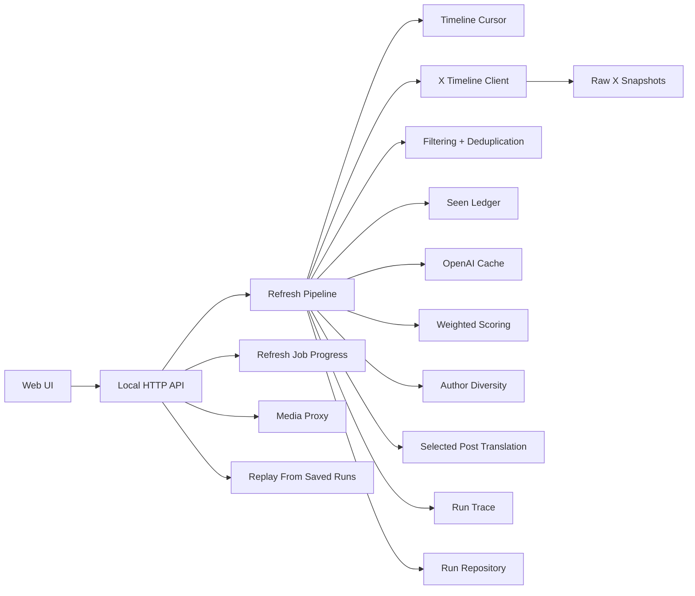

# Architecture

## Overview

The project uses a small dependency-free TypeScript architecture for V1. The web server and UI are intentionally simple, while core product logic is split into stable modules that can survive a future framework migration.



## Core Abstractions

- AI operation: `scoring` or `translation`.
- Configured model: one shared OpenAI model by default, with optional per-operation overrides for scoring and translation.
- Usage record: one external-call fact line with `provider`, `operation`, model or endpoint, item counts, tokens, quota fields, and timestamp. X usage can include both timeline loading and tweet lookup enrichment.
- Replay source: saved X-derived run data that produces no new X/OpenAI calls.
- Seen Ledger: local identities of posts already displayed in successful Online selected sets.
- Timeline Cursor: latest X post id observed by a successful Online timeline fetch.
- OpenAI Cache: cached OpenAI operation outputs keyed by operation, requested model, prompt version, and source-content fingerprint.
- Raw X Snapshot: provider evidence from X timeline page and tweet lookup responses before normalization.

## Modules

- `src/domain/`: shared product types.
- `src/config/`: scoring weights and prompt-facing configuration.
- `src/services/x/`: X API integration boundary.
- `src/services/x/apiTypes.ts`: local types for the X API response shape consumed by V1.
- `src/services/x/fieldProfile.ts`: reader-oriented X field, expansion, media, and user request profile.
- `src/services/x/normalize.ts`: pure conversion from X API payloads into `TimelinePost` and nested referenced-post structures.
- `src/services/x/enrichment.ts`: tweet lookup enrichment for missing referenced posts, including lookup raw snapshots and X usage records.
- `src/services/x/rateLimit.ts`: shared X rate-limit header parsing for timeline and lookup calls.
- `src/services/x/timelineCursor.ts`: best-effort freshness cursor for Online Pulse.
- `src/services/x/rawSnapshotStore.ts`: local raw X timeline page evidence.
- `src/services/replay/`: local replay from saved X runs/traces.
- `src/services/x/oauth.ts`: X OAuth 2.0 PKCE authorization, token exchange, token refresh, and `/users/me` lookup.
- `src/services/filtering/`: ad detection and duplicate removal.
- `src/services/scoring/`: weighted scoring.
- `src/services/selection/`: final selection policies such as author diversity.
- `src/services/seen/`: local Seen Ledger.
- `src/services/ai/`: translation.
- `src/services/openai/`: shared OpenAI Responses API, operation helpers, and OpenAI Cache.
- `src/services/pipeline/`: orchestration for one refresh run.
- `src/services/pipeline/candidates.ts`: candidate preparation for ad filtering, duplicate filtering, Seen Ledger filtering, and trace input snapshots.
- `src/services/pipeline/selection.ts`: scoring and author-diverse final selection for candidate posts.
- `src/services/pipeline/finalization.ts`: selected-post translation attachment and selected-post link preview enrichment.
- `src/services/pipeline/progress.ts`: per-refresh progress publishing and usage receipt line collection for pipeline stages.
- `src/services/pipeline/runAssembly.ts`: final `RefreshRun` stats and trace assembly from completed pipeline stage outputs.
- `src/services/pipeline/commitRefreshRun.ts`: commit rule for saving completed runs and mutating Online-only state.
- `src/services/trace/`: structured run evidence.
- `src/services/storage/`: persistence abstraction.
- `src/server/`: local HTTP server and API routes.
- `src/server/refreshJobs.ts`: in-memory Pulse job state, progress updates, job response shaping, and completed-run usage decoration.
- `public/`: browser UI.
- `public/reader/`: small browser-side reader helpers plus X-like link/media treatment, footer action rendering, status/usage presentation, and source/auth display rules used by `public/app.js`.
- `tests/`: unit tests and test helpers.

## Live Data Flow

1. User clicks `Pulse`.
2. In live mode, the server loads the Timeline Cursor and asks X for newer home-timeline posts with `since_id` when possible.
3. If newer pages are insufficient, the X client falls back to recent paginated home-timeline pages.
4. Each X page is saved as a Raw X Snapshot before normalization.
5. If normalized posts contain missing referenced-post ids, the X client batches tweet lookup requests to enrich those referenced posts before returning the timeline data. Lookup responses are also saved as Raw X Snapshots and recorded as X usage.
6. Filtering removes obvious ads.
7. Deduplication removes exact text duplicates and retweet duplicates.
8. Seen filtering removes posts already shown in previous successful Online selected sets.
9. Scoring reads OpenAI Cache entries for quality dimensions, calls OpenAI only for uncached candidates, and adds a local engagement dimension from latest X metrics.
10. Final selection applies author diversity after weighted ranking, using the reader-facing author. Retweets count as the reposted source author.
11. Up to 7 selected posts are translated into Chinese and saved, using OpenAI Cache when possible.
12. The saved successful Online run updates the Seen Ledger and Timeline Cursor.
13. The pipeline attaches `run.trace`, a structured record of input posts, filter/dedupe/seen decisions, scoring ranks, selection, translation, and the model/prompt configuration used for that refresh.
14. The browser polls the refresh job to show stage, model, processed item counts, and the refresh action's usage receipt.

Refresh jobs are an in-memory recoverability layer for the current server process. The browser stores the active job id while Pulse is running and reconnects after a page refresh. If the browser loses that id, it asks for the latest running job. If Pulse is clicked again while a job is already running, the server returns the running job instead of starting a second X/OpenAI refresh.

The HTTP server owns routing and dependency wiring. `RefreshJobStore` owns job lifecycle rules: one running job at a time, progress replacement, completed/failed state, commit-after-run ordering, and response shaping that omits full trace data from reader-facing job responses.

## Replay Data Flow

1. User clicks `Pulse` while the source status is set to replay.
2. Server finds the latest saved live X run in the local run store.
3. Server creates a new `source: "replay"` run from that saved run/trace.
4. Replay preserves recorded selected posts, scores, translations, and trace evidence.
5. Replay does not call X, OpenAI, scoring, or translation.
6. Replay does not read or write Seen Ledger, Timeline Cursor, Raw X Snapshots, or OpenAI Cache entries.
7. Replay action usage is empty because no provider request happened during replay.

## X API Strategy

V1 is designed around X's authenticated home timeline API:

```txt
GET /2/users/{id}/timelines/reverse_chronological
```

The project expects OAuth 2.0 user context. `X_USER_ID` and `X_USER_ACCESS_TOKEN` may be configured manually. The local OAuth flow stores user tokens in `.data/x-oauth.json`, which is ignored by git.

The X client requests a broad reader-oriented field profile: tweet URL entities, note-tweet full text, edit metadata, attached media expansions, nested referenced-tweet media expansions, media variants, referenced tweet expansions, author fields, and public metrics. `TimelinePost` stores structured `links`, URL preview metadata, media URL keys, `media`, media playback variants, media duration, and recursive `referencedPost` data so the Reader can avoid naked `t.co` text, render source images/videos inline, autoplay saved video variants, show URL preview cards when preview evidence exists, and show quoted posts as X-like cards.

X timeline expansion can still omit a nested quoted post, especially when the home-timeline item is a retweet and the retweeted source itself quotes another post. The X client treats that as incomplete normalization and calls:

```txt
GET /2/tweets?ids=...
```

for missing referenced ids. This enrichment is capped to a small recursive depth, batched up to X's lookup limits, saved as raw X evidence, and recorded as `operation: "x.lookup"` usage. The Reader should consume the enriched structure rather than compensating for missing nested quotes in UI code.

Retweets are normalized as timeline items with a referenced source post. The Reader renders the source post as the main content and keeps the retweeting account as context. Scoring, translation, engagement metrics, original-link navigation, and author diversity use that same reader-facing source post. This prevents the UI and model layer from treating an `RT @...` wrapper as the content the user is meant to read.

Raw X Snapshots keep recent provider responses under `.data/x-snapshots.json` before normalization. When UI fidelity is missing, inspect the latest raw snapshot first. Replay preserves normalized fields when they exist in saved live runs. Older saved runs without newly required X fields, such as media variants, media URL keys, link preview images, or recursively enriched referenced posts, are treated as obsolete for those surfaces; a fresh Online Pulse should replace them rather than adding reader-side compatibility paths field by field.

## External Link Preview Enrichment

X API URL entities sometimes include only `url`, `expanded_url`, and `display_url` even when X's own detail page renders a full external preview card. Online Pulse handles that as a post-selection enrichment step:

- Score and translate using the X-derived post content first.
- Select the final Top results.
- For selected posts only, resolve ordinary external web links that still lack preview metadata.
- Cache the result in `.data/link-preview-cache.json` by normalized target URL.
- Store the resolved preview on the selected post and trace snapshot so Offline replay keeps the same reader-facing card.

This cache is intentionally separate from OpenAI Cache. It does not affect OpenAI scoring or translation fingerprints, and it does not include engagement metrics, ranking weights, selected count, seen policy, or author diversity. X-owned links, X media links, local/private hosts, and links that already have preview metadata are skipped. The Reader turns cached preview evidence into a visible preview card only for ordinary no-attached-media post shapes; posts with attached X image/video media keep additional external URLs inline while the media remains the primary rich object.

## Media Proxy Strategy

The Reader stores original X media URLs, but browser playback for `https://video.twimg.com/...` can fail from `localhost` with 403 responses. The local server exposes a narrow media proxy:

```txt
GET /api/media/proxy?url=https%3A%2F%2Fvideo.twimg.com%2F...
```

The proxy only allows `https://video.twimg.com` URLs, forwards the browser `Range` header, streams the upstream response, and returns video headers such as `content-range` and `accept-ranges`. Inline videos and the media viewer use this same-origin proxy URL for playback while the saved run still keeps the original X-derived media variant URL.

## AI Strategy

The AI layer has two live operations:

- Scoring: score and rank live X candidates with OpenAI structured JSON output.
- Translation: translate selected posts during live refresh with OpenAI structured JSON output.

There is no local AI fallback in the live path. Scoring and translation batches must be complete: each input post id needs exactly one returned object. If a live X scoring or translation batch omits ids, invents ids, duplicates ids, or fails, the refresh fails and does not generate a selected set.

OpenAI Cache stores operation outputs, not final ranking decisions. Cache keys include operation, requested model, prompt version, and a source-content fingerprint. They exclude engagement metrics, weights, Top count, author diversity, and seen policy. This lets Online Pulse reuse OpenAI quality judgments and translations while recalculating latest engagement and selection rules.

OpenAI scoring sees reader-facing post content and referenced-post content. For retweets, the prompt sends the reposted source post as the content and includes the reposting account only as timeline context. It does not receive X engagement metrics. The local scoring layer adds the `互动信号` dimension from latest X metrics after OpenAI returns `立即值得看` and `信息密度`; for retweets, those metrics come from the reposted source post.

OpenAI translation follows the same reader-facing rule. For retweets, it translates the reposted source post and returns the selected timeline item id so the saved run remains tied to the selected item.

OpenAI Responses requests use a 10-minute default timeout because production scoring with `gpt-5` can be slow for full refresh batches. Timeout errors should be reported explicitly as OpenAI request timeouts, not as generic aborted operations.

The OpenAI client may retry a small number of pre-response network failures such as connection timeouts. It does not retry HTTP errors, schema errors, incomplete model output, unknown ids, or duplicate ids, because those are semantic failures rather than transport glitches.

If a scoring or translation response only omits ids, the operation may make one same-model repair request for the missing ids. The repair request is recorded as a normal OpenAI usage line. Unknown ids or duplicate ids still fail immediately, and an incomplete repair response still fails the refresh.

## Replay Strategy

Replay is the only local data path. It reads saved local X-derived run data, currently from `.data/runs.json`, and creates a new `source: "replay"` run without calling X or OpenAI. Replay preserves recorded selected posts, scores, translations, and trace evidence. Its per-action usage is empty because no new provider request happened.

Replay chooses the latest saved live X run as its source. If no live X run exists, replay fails and asks for one live X refresh first. Saved run/trace files under `.data/` can be edited to change replayed data. These files are ignored by git and may contain private timeline data.

The file run repository caps stored history but preserves the latest `source: "x"` run when replay entries roll over. This keeps offline replay anchored to a real X-derived source and prevents repeated local replay actions from deleting the only high-fidelity live sample.

Each external call is recorded as a `UsageRecord`, which acts as a usage receipt line. OpenAI records include provider, operation, actual response model, item count, item ids, input tokens, output tokens, total tokens, cached input tokens, and reasoning tokens when available. X API records include provider, endpoint, method, returned item count, item ids, and rate-limit metadata when available. Refresh uses background jobs plus polling for progress. Scoring is processed in batches instead of one request per post, so the UI can show real batch progress without multiplying request overhead.

Usage records are grouped into action-level `UsageReceipt` objects for API responses and UI rendering. A refresh receipt aggregates X timeline loading, scoring batches, and translation batches for that one refresh. The app does not sum usage across different refreshes. Receipts are computed from stored lines rather than treated as a separate global ledger.

## Run Trace Strategy

Each refresh stores a `RunTrace` on the saved run. The trace is a local evidence layer, not a feedback product. It records fetched posts in order, ad-filter decisions, dedupe decisions, seen decisions, scoring ranks, selected posts, translation status, effective models, prompt versions, scoring weights, and batch sizes.

The Reader UI ignores trace data. Reader-facing run responses omit the full trace by default, while `GET /api/runs/{runId}/trace` can return it explicitly.

The intended model configuration is:

```txt
OPENAI_MODEL=gpt-5
SELECTED_POST_COUNT=7
```

Operation-specific model overrides remain available for advanced use. To lower OpenAI cost, set `OPENAI_MODEL` to a cheaper model.

## Future Extension Points

- Add OAuth login UI and encrypted token storage.
- Replace file storage with SQLite.
- Add better replay selection and local editing tools for saved X-derived traces.
- Add replay-based prompt comparison artifacts.
- Build separate prompt/ranking tools that read saved run traces.
- Add more ranking dimensions.
- Add personal preference profile.
- Migrate UI to Next.js or another frontend framework while keeping domain modules.
